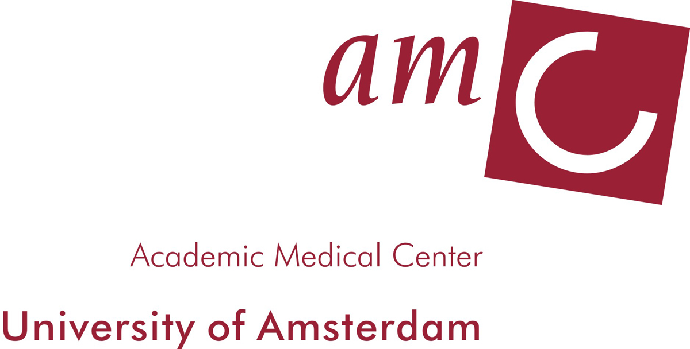
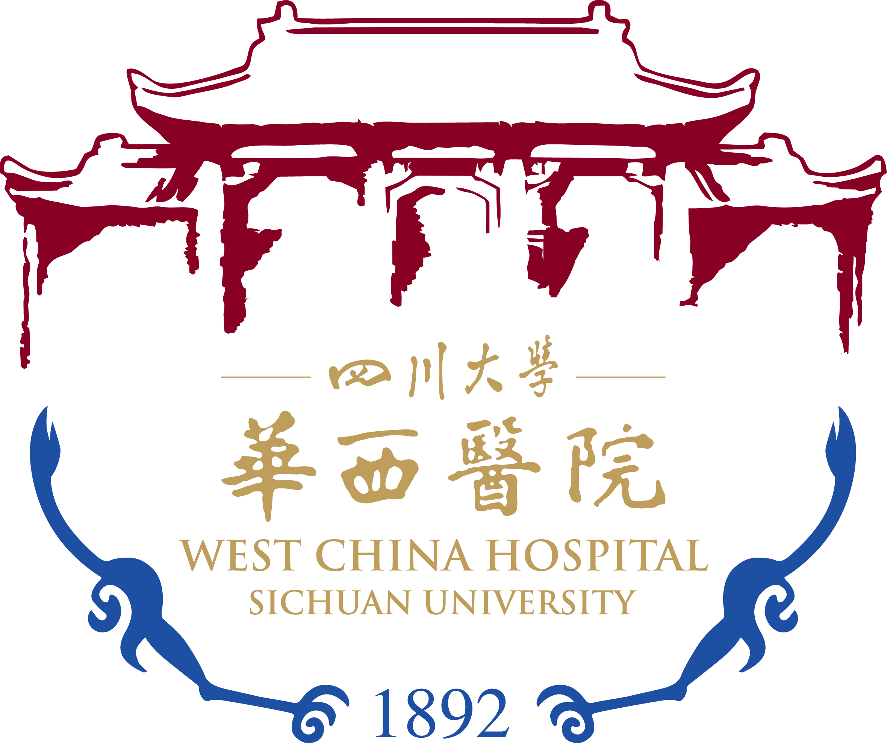

  
Academic Medical Center, University of Amsterdam  
Dr. Louis Vermeulen, Dr. Maarten Bijsma, Dr. Frederike Dijk & Prof. Jan Paul Medema 

  

  
The Chinese University of Hong Kong  
Prof. Nathalie Wong  

  

  
Baylor Scott & White Research Institute  
Dr. Raju Kandimalla & Prof. Ajay Goel  

  

  
Cornell University  
Prof. Andrew Yen & Jeffrey D. Varner  

  

  
Sichuan University  
Dr. Shengtao Zhou

  

  
Queen Elizabeth Hospital
Dr. Timothy Yip

  

  
City University of Hong Kong  
Dr. Peng Shi, Dr. Ming Chan, Dr. Youngjin Lee, etc.  
