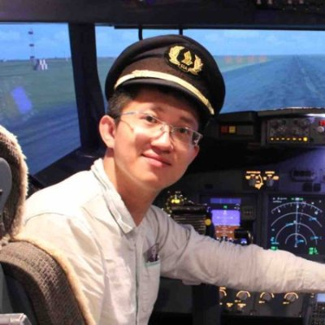
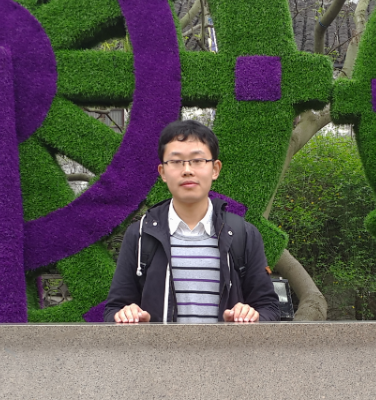
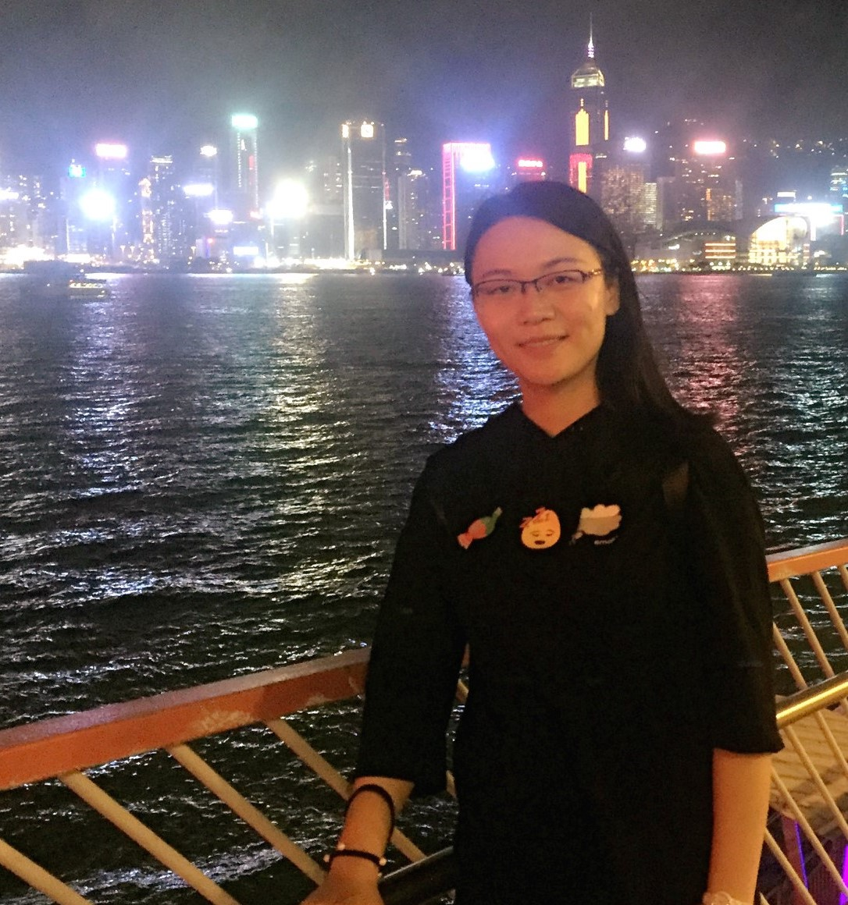
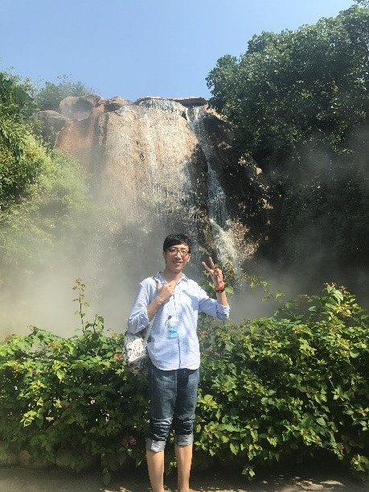

| | |
|:----------------|:---------------------------------|
||**Dr Xin WANG** **Assistant Professor, Department of Biomedical Sciences, City University of Hong Kong** \
Postdoctoral Fellow, Harvard Medical School, Dr. Peter Kharchenko PhD, Department of Oncology and Cancer Research UK Cambridge Institute, University of Cambridge, Dr. Florian Markowetz  Office:	1B-102, 1/F, Block 1, To Yuen Building Phone:	+852 3442-2367 Fax:	+852 3442-0549 Email: xin.wang_at_cityu.edu.hk|
||**Feng GAO** Joint PhD Student with Cornell University B.E in Computer Science and Technology  Feng is mainly focusing on  applying artificial intelligence technologies such as deep learning to cancer research, including but not limited to *patient stratification, biomarker and target discovery.*  Linkedin: https://hk.linkedin.com/in/feng-gao-3b7bb33a|
||**Wei WANG** PhD Student M.S in Microbiology  Wei is currently working on cancer prognosis prediction, including building a new model to predict relapse and identifying predictive biomarkers.|
||**Xin DUAN** Visiting PhD Student M.E in Pattern Recognition  Xin DUAN has expertise at image processing and is currently working on drug screening using brain image in zebrafish model.|
||**Yuchen ZHANG**  PhD Student M.E in Pattern Recognition  Yuchen started focusing on bioinformatics during master study. Now his interests are mainly on cancer-specific regulatory network analysis and data mining problems in epigenetics.|
| |**Lina ZHU** Joint PhD Student with Cornell University B.S in Bioinformatics  Lina is in her 2nd year of PhD, devoting herself to applying bioinformatics into epigenetics.|
| |**Hao HUANG** Joint PhD Student with Cornell University M.S in Biophysics  Hao is mainly focusing on applying bioinformatics to cancer research.|
| |**Ying LI** PhD Student M.S in Bioinformatics  Lin was started to get involved in research of bioinformatics during his master study. He is currently working on integrate analysis of multi-omic data.|
| |**Lin QI** Visiting Master Student M.E in Pattern Recognition  Ying is currently working on analyzing intra-tumor and inter-tumor heterogeneity and developing a model for a combinatorial prognostic biomarker.|

