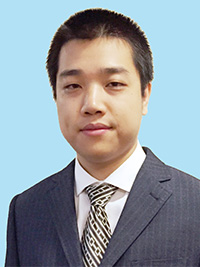

| | |
|:----------------|:---------------------------------|
||**Dr Xin WANG** **Assistant Professor, Department of Biomedical Sciences, City University of Hong Kong** \
Postdoctoral Fellow, Harvard Medical School, Dr. Peter Kharchenko PhD, Department of Oncology and Cancer Research UK Cambridge Institute, University of Cambridge, Dr. Florian Markowetz  Office:	1B-102, 1/F, Block 1, To Yuen Building Phone:	+852 3442-2367 Fax:	+852 3442-0549 Email: xin.wang_at_cityu.edu.hk|
||**Feng GAO** PhD Student B.E in Computer Science and Technology  Feng is mainly focusing on  applying artificial intelligence technologies such as deep learning to cancer research, including but not limited to *patient stratification, biomarker and target discovery.*  Linkedin: https://hk.linkedin.com/in/feng-gao-3b7bb33a|
| |**Wei WANG** PhD Student M.S|
| |**Duan XIN** Visiting PhD Student M.S|
| |**Lan ZHAO** PhD Student M.S|
| |**Yuchen ZHANG**  PhD Student M.S|
| |**Lina ZHU** PhD Student B.S in Bioinformatics|

